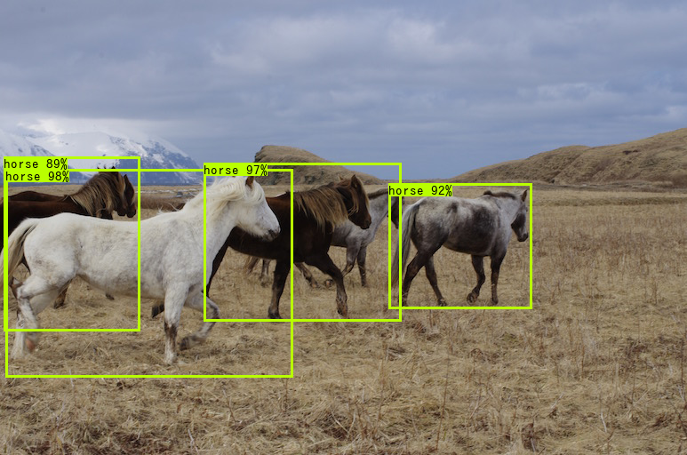

# pytorch-yolov3



## About

simple Pytorch implementation of YOLOv3 / YOLOv3-tiny.

## Features

- [x]: Support darknet format weights
- [x]: Sample code for infering image and video
- [ ]: Sample code for training and validating (WIP)

## Usage

### Download weights

Install the dependent libraries.

```bash
pip install -r requirements.txt
```

Download the official weights.

```bash
./weights/download_weights.sh
```

### Infer a single image (YOLOv3)

```bash
python detect_image.py \
    --input data/dog.png \
    --output output \
    --weights weights/yolov3.weights \
    --config config/yolov3_coco.yaml
```

### Infer images in the dicretory.

```bash
python detect_image.py \
    --input data \
    --output output \
    --weights weights/yolov3.weights \
    --config config/yolov3_coco.yaml
```

### Infer video

```bash
python detect_video.py \
    --input data/sample.avi \
    --output output \
    --weights weights/yolov3.weights \
    --config config/yolov3_coco.yaml
```

### Train Custom Dataset


### Evaluate COCO

```
python evaluate_coco.py \
    --dataset_dir /data/COCO \
    --anno_path config/instances_val5k.json \
    --weights weights/yolov3.weights \
    --config config/yolov3_coco.yaml
```

```
 Average Precision  (AP) @[ IoU=0.50:0.95 | area=   all | maxDets=100 ] = 0.311
 Average Precision  (AP) @[ IoU=0.50      | area=   all | maxDets=100 ] = 0.558
 Average Precision  (AP) @[ IoU=0.75      | area=   all | maxDets=100 ] = 0.313
 Average Precision  (AP) @[ IoU=0.50:0.95 | area= small | maxDets=100 ] = 0.141
 Average Precision  (AP) @[ IoU=0.50:0.95 | area=medium | maxDets=100 ] = 0.339
 Average Precision  (AP) @[ IoU=0.50:0.95 | area= large | maxDets=100 ] = 0.457
 Average Recall     (AR) @[ IoU=0.50:0.95 | area=   all | maxDets=  1 ] = 0.275
 Average Recall     (AR) @[ IoU=0.50:0.95 | area=   all | maxDets= 10 ] = 0.416
 Average Recall     (AR) @[ IoU=0.50:0.95 | area=   all | maxDets=100 ] = 0.437
 Average Recall     (AR) @[ IoU=0.50:0.95 | area= small | maxDets=100 ] = 0.238
 Average Recall     (AR) @[ IoU=0.50:0.95 | area=medium | maxDets=100 ] = 0.477
 Average Recall     (AR) @[ IoU=0.50:0.95 | area= large | maxDets=100 ] = 0.603
0.31082299897937926 0.5579624636166972
```
